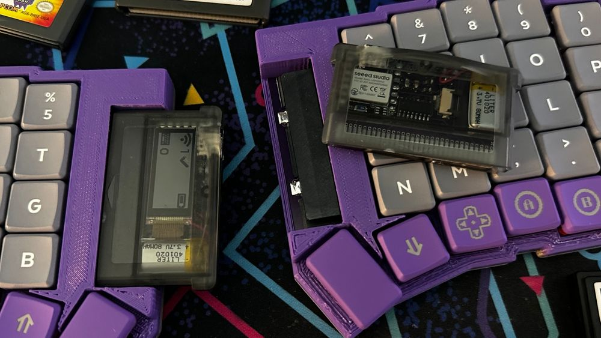
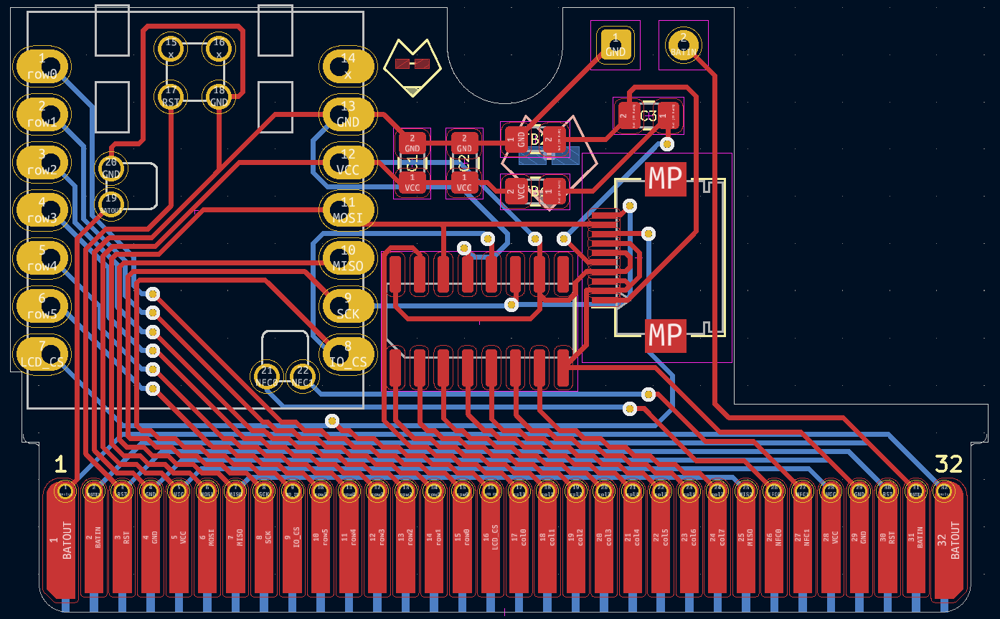
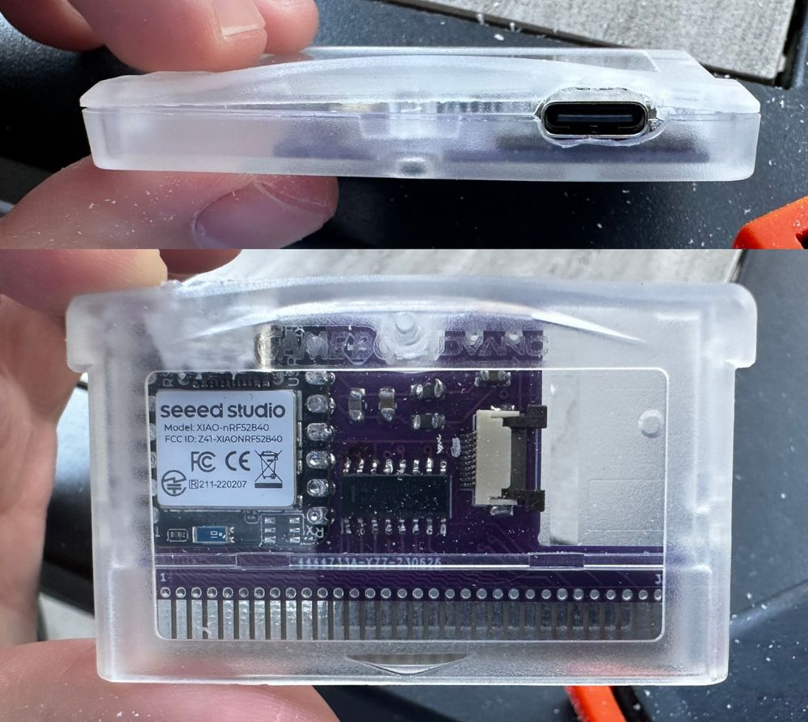
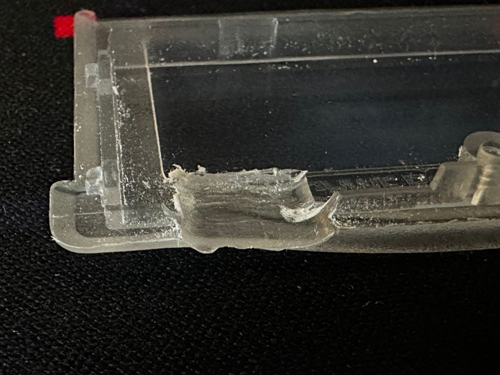

# The TypePak

The TypePak is a custom keyboard controller PCB housed inside of an aftermarket Game Boy Advance cartridge shell. It features Bluetooth connectivity, ZMK support, a low-power monochrome display, a built in LiPo battery, 9 GPIO pins, and 8 dedicated output pins. Simply slot the TypePak into a keyboard with a compatible Game Boy cartridge slot, flip the power switch, and you've got yourself a working wireless keyboard. (After flashing the appropriate firmware and keymap, naturally.)

Unlike its companion TypeBoy, the TypePak was designed in KiCAD from scratch. Sadly there aren't any esoteric Game Boy cartridge generators just yet. This repository contains a standard KiCAD project. There's a schematic, a routed PCB, and a Gerber file.

## Layout & Pinout

The heart of the TypePak is a XIAO nRF52840 microcontroller. It handles all of the Bluetooth communication, the wireless battery charging, and USB connectivity. The XIAO "BLE" famously has several pins mouted in the middle of the board on its underside, so the TypePak has several small holes in the PCB to reach the reset, power, and NFC pins.

There's a few additional pieces of hardware mounted onto the board. The TypePak features a LS011B7DH03 Sharp Memory Display. This is the same module found on the Nice!View keyboard display, but instead leverages karnadii's excellent [sharp_memory_display_breakout](https://github.com/karnadii/sharp_memory_display_breakout) circuit design. The microcontroller also takes advantage of a 74HC595 shift register to provide several more output pins. All of this is powered by a 401020 LiPo battery.

A Game Boy cartridge has 32 pins on its edge connector. The XIAO nRF52840 and the shift register have a total of 26 pins. Rather than leave twenty precent of the TypePak's cartridge pins unused, several of the important pins are exposed on both ends of the cartridge's edge connector. The battery output, power pins, reset pins, and a few others are duplicated so that you can more easily route some of the support hardware on your keyboard PCB.

Speaking of which, the TypePak does not have a built in power switch or reset button of its own. (Technically the XIAO does have a reset button, but it's underneath the cartridge's plastic casing.) You'll need to create out these components on the keyboard itself. The whole idea of this setup is to evoke the stylings of a classic Game Boy, so a large chunky power switch is honestly a welcome addition. Just remember, the battery is physically disconnected unless the keyboard's power switch is turned on, so the TypePak can't charge when disconnected from a board.

## Building a TypePak

The TypePak is enclosed inside of an aftermarket Game Boy Advance cartridge. Believe it or not, these cartridges typically did not feature cutouts for USB-C ports. You'll need to drill one into the side of your cartridge so that the TypePak can charge and be flashed with new firmware.

Cutting a hole in the side of the cartridge won't be enough. You'll also need to shave away some of the inside of the top of the case. You should be able to leave most of the exterior of the top untouched. There's *just* enough material on the inside of the case to make everything fit. The cartridge may bow slightly, but you should be able to get all the tabs locked securely into place and the fastener screw fully secured into place. Aftermarket cartridges are fairly cheap, so you may want to buy an extra to practice on.

## Build of Materials

TBD.